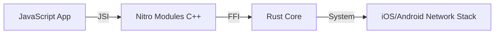

# react-native-nitro-dgram 🚀

Ultra-high-performance Node.js `dgram` (UDP) implementation for React Native. Powered by **Nitro Modules** (C++/JSI) and a robust **Rust core** for maximum efficiency and low latency.

[](https://github.com/iwater/react-native-nitro-dgram/blob/main/LICENSE)
[]()
[]()
[中文文档](./README_zh.md)

## Why Nitro Dgram?

- **100% API Compatibility**: Drop-in replacement for Node's `dgram`. Move your server/client logic from Node to Mobile without changing a single line.
- **Nitro Powered**: Leveraging the next-gen Nitro Modules (JSI) for direct C++ to JS communication, bypassing the heavy React Native Bridge.
- **Rust Reliability**: The core socket logic is written in Rust, ensuring maximum safety, performance, and low-latency networking.
- **Modern Features**: Built-in support for `AbortSignal`, `AsyncDispose`, and `BlockList`.

## Features

- [x] **Full dgram API**: `udp4` & `udp6` support.
- [x] **Connected Sockets**: Using `connect()` for dedicated peer communication.
- [x] **Multicast**: Full support for joining/dropping groups, including **SSM (Source-Specific Multicast)**.
- [x] **Scatter-Gather I/O**: Send multiple buffers in a single syscall via `send([buf1, buf2], ...)`.
- [x] **Queue Monitoring**: Real-time tracking of pending send bytes and packet counts.
- [x] **Security**: Integrated `BlockList` for IP-level filtering.
- [x] **Resource Management**: Native `AbortSignal` integration and `Symbol.asyncDispose`.

## Installation

```bash
yarn add react-native-nitro-dgram react-native-nitro-buffer
# or
npm install react-native-nitro-dgram react-native-nitro-buffer
```

## Quick Start

```typescript
import { createSocket } from 'react-native-nitro-dgram';
import { Buffer } from 'react-native-nitro-buffer';

const server = createSocket('udp4');

server.on('message', (msg, rinfo) => {
  console.log(`Received ${msg.length} bytes from ${rinfo.address}:${rinfo.port}`);
  // Echo back
  server.send(msg, rinfo.port, rinfo.address);
});

server.on('listening', () => {
  const address = server.address();
  console.log(`Server listening on ${address.address}:${address.port}`);
});

server.bind(41234);
```

## Advanced Usage

### Source-Specific Multicast (SSM)

```typescript
const socket = createSocket('udp4');
socket.bind(12345, () => {
  // Join a group only from a specific source
  socket.addSourceSpecificMembership('192.168.1.100', '232.0.0.1');
});
```

### Sending Multiple Buffers (Scatter-Gather)

```typescript
const part1 = Buffer.from('Hello ');
const part2 = Buffer.from('World!');

// Sends both buffers in a single efficient native operation
socket.send([part1, part2], 41234, '127.0.0.1');
```

### Queue Monitoring

```typescript
// Useful for implementing backpressure or monitoring throughput
const pendingPackets = socket.getSendQueueCount();
const pendingBytes = socket.getSendQueueSize();
```

## Architecture



## Comparison

| Feature | `react-native-udp` (Bridge) | `react-native-nitro-dgram` |
| :--- | :--- | :--- |
| **Communication** | Async Bridge (JSON/Base64) | Synchronous JSI (Ultra-Fast) |
| **Buffer Handling** | Base64 Encoding | Direct Memory Access |
| **Compatibility** | Partial | 100% Node.js Dgram |
| **Core Engine** | Native Java/ObjC | Zero-Cost Rust |

## License

ISC
