# react-native-nitro-dgram 🚀

针对 React Native 打造的超高性能 Node.js `dgram` (UDP) 实现。由 **Nitro Modules** (C++/JSI) 和强大的 **Rust 核心** 驱动，旨在提供极致的效率和极低的延迟。

[](https://github.com/iwater/react-native-nitro-dgram/blob/main/LICENSE)
[]()
[]()

## 为什么选择 Nitro Dgram？

- **100% API 兼容性**: Node.js `dgram` 模块的掉入式替代方案。无需修改任何代码，即可将您的服务器/客户端逻辑从 Node 迁移到移动端。
- **Nitro 驱动**: 利用下一代 Nitro Modules (JSI) 进行直接的 C++ 到 JS 通信，完全绕过沉重的 React Native Bridge。
- **Rust 可靠性**: 核心套接字逻辑由 Rust 编写，确保最高安全性、性能和低延迟网络。
- **现代特性**: 内置支持 `AbortSignal`、`AsyncDispose` 和 `BlockList`。

## 特性

- [x] **完整 dgram API**: 支持 `udp4` 和 `udp6`。
- [x] **连接模式 (Connected Sockets)**: 使用 `connect()` 进行对等点专用通信。
- [x] **多播 (Multicast)**: 完整支持加入/离开组，包括 **SSM (Source-Specific Multicast)**。
- [x] **分散-集中 I/O (Scatter-Gather)**: 通过 `send([buf1, buf2], ...)` 在单个系统调用中发送多个缓冲区。
- [x] **队列监控**: 实时追踪待发送的字节总数和数据包数量。
- [x] **安全性**: 集成 `BlockList` 进行 IP 级过滤。
- [x] **资源管理**: 原生 `AbortSignal` 集成和 `Symbol.asyncDispose` 支持。

## 安装

```bash
yarn add react-native-nitro-dgram react-native-nitro-buffer
# 或者
npm install react-native-nitro-dgram react-native-nitro-buffer
```

## 快速上手

```typescript
import { createSocket } from 'react-native-nitro-dgram';
import { Buffer } from 'react-native-nitro-buffer';

const server = createSocket('udp4');

server.on('message', (msg, rinfo) => {
  console.log(`收到来自 ${rinfo.address}:${rinfo.port} 的 ${msg.length} 字节数据`);
  // 原样返回 (Echo)
  server.send(msg, rinfo.port, rinfo.address);
});

server.on('listening', () => {
  const address = server.address();
  console.log(`服务器正在监听 ${address.address}:${address.port}`);
});

server.bind(41234);
```

## 高级用法

### 源特定多播 (SSM)

```typescript
const socket = createSocket('udp4');
socket.bind(12345, () => {
  // 仅加入来自特定源的多播组
  socket.addSourceSpecificMembership('192.168.1.100', '232.0.0.1');
});
```

### 发送多个缓冲区 (Scatter-Gather)

```typescript
const part1 = Buffer.from('Hello ');
const part2 = Buffer.from('World!');

// 在单个高效的跨端操作中发送两个缓冲区
socket.send([part1, part2], 41234, '127.0.0.1');
```

### 队列监控

```typescript
// 用于实现背压 (Backpressure) 或监控吞吐量
const pendingPackets = socket.getSendQueueCount();
const pendingBytes = socket.getSendQueueSize();
```

## 架构

```mermaid
graph LR
    JS[JavaScript App] -- JSI --> Nitro[Nitro Modules C++]
    Nitro -- FFI --> Rust[Rust Core]
    Rust -- 系统 --> OS[iOS/Android 网络栈]
```



## 对比

| 特性 | `react-native-udp` (Bridge) | `react-native-nitro-dgram` |
| :--- | :--- | :--- |
| **通信机制** | 异步 Bridge (JSON/Base64) | 同步 JSI (极速) |
| **缓冲区处理** | Base64 编码 | 直接内存访问 |
| **兼容性** | 部分兼容 | 100% Node.js Dgram |
| **核心引擎** | 原生 Java/ObjC | 零成本 Rust |

## 许可证

ISC
